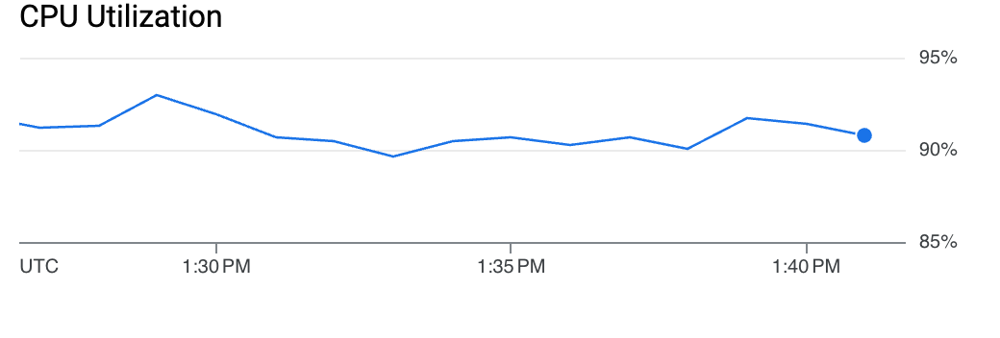
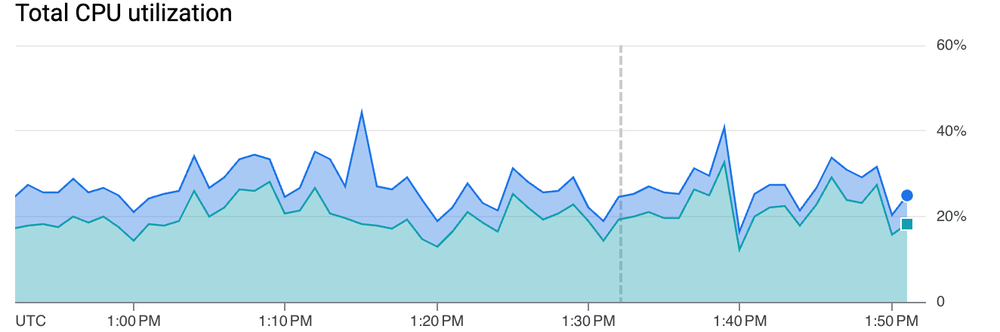

# TesseraCT Storage Performance

TesseraCT is designed to meet current CT issuance load in a cost-effective manner.

The performance tests were conducted in a controlled environment with deterministic synthetic certificates for a limited amount of time. QPS was measured using the average values collected over the test period.

> [!NOTE]
> These are not definitive numbers, and that more tests are to come with an improved codebase.

## Backends

### GCP

The indicative figures below were measured using the [CT hammer tool](/internal/hammer/) as of [commit `fe7687c`](https://github.com/transparency-dev/tesseract/commit/fe7687c9ed35d11f42a211ee35544ff6c5610ee6). 

The table below shows the measured performance over 12 hours in each instance type:

| Instance Type                        | Cloud Spanner | Write QPS |
| ------------------------------------ | ------------- | --------- |
| e2-micro (2 vCPUs, 1 GB Memory)      | 100 PUs       | 60        |
| e2-medium (2 vCPUs, 4 GB Memory)     | 100 PUs       | 250       |
| e2-standard-2 (2 vCPUs, 8 GB Memory) | 100 PUs       | 600       |

#### Free Tier e2-micro VM Instance + Cloud Spanner 100 PUs

- e2-micro (2 vCPUs, 1 GB Memory)

The write QPS is around 60. The bottleneck comes from the VM CPU usage which is always above 90%. The Cloud Spanner CPU utilization is around 10%.

```
┌───────────────────────────────────────────────────────────────────────┐
│Read (0 workers): Current max: 0/s. Oversupply in last second: 0       │
│Write (512 workers): Current max: 68/s. Oversupply in last second: 0   │
│TreeSize: 18372087 (Δ 61qps over 30s)                                  │
│Time-in-queue: 59ms/283ms/1990ms (min/avg/max)                         │
│Observed-time-to-integrate: 79ms/3393ms/8717ms (min/avg/max)           │
└───────────────────────────────────────────────────────────────────────┘
```

```
top - 22:38:30 up 12:08,  2 users,  load average: 0.26, 1.20, 1.78
Tasks:  96 total,   1 running,  95 sleeping,   0 stopped,   0 zombie
%Cpu(s): 63.2 us,  9.4 sy,  0.0 ni,  3.8 id, 21.7 wa,  0.0 hi,  0.9 si,  0.9 st 
MiB Mem :    970.0 total,     77.0 free,    901.2 used,    123.0 buff/cache     
MiB Swap:      0.0 total,      0.0 free,      0.0 used.     68.8 avail Mem 

    PID USER      PR  NI    VIRT    RES    SHR S  %CPU  %MEM     TIME+ COMMAND
  61449 user      20   0 2183904 342948  12156 S 183.0  34.5  29:35.23 gcp
```

<details>

<summary>Graphs</summary>





</details>

#### e2-medium VM Instance + Cloud Spanner 100 PUs

- e2-medium (2 vCPUs, 4 GB Memory)

The write QPS is around 250. The bottleneck comes from the VM CPU utilization which is always around 100%. The Cloud Spanner CPU utilization is around 20%.

```
┌──────────────────────────────────────────────────────────────────────┐
│Read (0 workers): Current max: 0/s. Oversupply in last second: 0      │
│Write (512 workers): Current max: 302/s. Oversupply in last second: 0 │
│TreeSize: 11084877 (Δ 224qps over 30s)                                │
│Time-in-queue: 48ms/627ms/1717ms (min/avg/max)                        │
│Observed-time-to-integrate: 1480ms/5401ms/8748ms (min/avg/max)        │
└──────────────────────────────────────────────────────────────────────┘
```

```
top - 19:16:15 up 21:43,  2 users,  load average: 1.60, 1.46, 1.50
Tasks:  96 total,   2 running,  94 sleeping,   0 stopped,   0 zombie
%Cpu(s): 86.8 us,  4.0 sy,  0.0 ni,  6.2 id,  0.0 wa,  0.0 hi,  2.2 si,  0.9 st 
MiB Mem :   3924.7 total,   1204.9 free,   2422.4 used,    519.0 buff/cache     
MiB Swap:      0.0 total,      0.0 free,      0.0 used.   1502.3 avail Mem 

    PID USER      PR  NI    VIRT    RES    SHR S  %CPU  %MEM     TIME+ COMMAND
  72343 user      20   0 5082652   1.5g  22856 R 182.7  39.5      6,24 gcp     
```

<details>

<summary>Graphs</summary>


</details>

#### e2-standard-2 VM Instance + Cloud Spanner 100 PUs

- e2-standard-2 (2 vCPUs, 8 GB Memory)

The write QPS is around 600. The bottleneck comes from the VM CPU utilization which is always around 100%. The Cloud Spanner CPU utilization is around 50%.

```
┌──────────────────────────────────────────────────────────────────────┐
│Read (342 workers): Current max: 0/s. Oversupply in last second: 0    │
│Write (683 workers): Current max: 655/s. Oversupply in last second: 0 │
│TreeSize: 14103952 (Δ 583qps over 30s)                                │
│Time-in-queue: 57ms/506ms/1139ms (min/avg/max)                        │
│Observed-time-to-integrate: 642ms/4855ms/9637ms (min/avg/max)         │
└──────────────────────────────────────────────────────────────────────┘
```

```
top - 11:12:32 up 58 min,  2 users,  load average: 1.94, 1.94, 1.91
Tasks:  96 total,   1 running,  95 sleeping,   0 stopped,   0 zombie
%Cpu(s): 88.0 us,  3.7 sy,  0.0 ni,  5.6 id,  0.0 wa,  0.0 hi,  2.7 si,  0.0 st 
MiB Mem :   7950.7 total,   4980.7 free,   2029.3 used,   1179.2 buff/cache     
MiB Swap:      0.0 total,      0.0 free,      0.0 used.   5921.5 avail Mem 

    PID USER      PR  NI    VIRT    RES    SHR S  %CPU  %MEM     TIME+ COMMAND
   2114 user      20   0 5211120   1.1g  28572 S 186.7  13.6  78:15.01 gcp
```

<details>

<summary>Graphs</summary>


</details>

### AWS

The indicative figures below were measured using the [CT hammer tool](/internal/hammer/) as of [commit `fe7687c`](https://github.com/transparency-dev/tesseract/commit/fe7687c9ed35d11f42a211ee35544ff6c5610ee6).

#### t3a.small EC2 Instance + Aurora MySQL db.r5.large

- t3a.small (2 vCPUs, 2 GB Memory)
  - General Purpose SSD (gp3)
    - IOPS: 3,000
    - Throughput: 125 MiB/s

The write QPS is around 450. The bottleneck comes from the VM CPU utilization which is always around 100%. The Aurora MySQL CPU utilization is around 30%.

```
┌────────────────────────────────────────────────────────────────────────┐
│Read (8 workers): Current max: 0/s. Oversupply in last second: 0        │
│Write (512 workers): Current max: 572/s. Oversupply in last second: 0   │
│TreeSize: 2323927 (Δ 470qps over 30s)                                   │
│Time-in-queue: 84ms/887ms/1691ms (min/avg/max)                          │
│Observed-time-to-integrate: 4962ms/6769ms/10524ms (min/avg/max)         │
└────────────────────────────────────────────────────────────────────────┘
```

```
top - 22:52:24 up 1 day,  4:23,  2 users,  load average: 1.78, 1.79, 1.21
Tasks: 110 total,   1 running, 109 sleeping,   0 stopped,   0 zombie
%Cpu(s): 75.1 us,  9.0 sy,  0.0 ni,  5.6 id,  0.0 wa,  0.0 hi,  8.5 si,  1.8 st
MiB Mem :   1907.4 total,    427.7 free,    950.6 used,    529.2 buff/cache
MiB Swap:      0.0 total,      0.0 free,      0.0 used.    704.2 avail Mem 

    PID USER      PR  NI    VIRT    RES    SHR S  %CPU  %MEM     TIME+ COMMAND
  92354 ec2-user  20   0 2794864 560568  14980 S 182.7  28.7  48:42.28 aws
```
