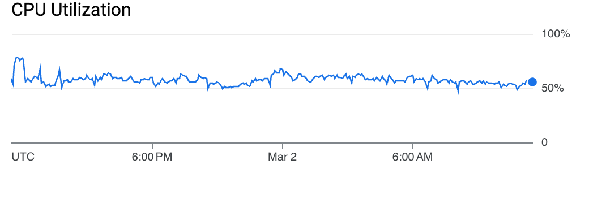

# TesseraCT Storage Performance

TesseraCT is designed to meet current CT issuance load in a cost-effective manner.

The indicative figures below were measured using the [CT hammer tool](/internal/hammer/) as of [commit `2872ea2`](https://github.com/transparency-dev/static-ct/commit/2872ea2387b2d3077eb832112277eb19a7a907bd). The performance tests were conducted in a controlled environment with deterministic synthetic certificates for a limited amount of time. QPS was measured using the average values collected over the test period.

> [!NOTE]
> These are not definitive numbers, and that more tests are to come with an improved codebase.

## Backends

### GCP

The table below shows the measured performance over 12 hours in each instance type:

| Instance Type                    | Cloud Spanner | Write QPS |
| -------------------------------- | ------------- | --------- |
| e2-micro (2 vCPUs, 1 GB Memory)  | 100 PUs       | 60        |
| e2-medium (2 vCPUs, 4 GB Memory) | 100 PUs       | 150       |
| e2-medium (2 vCPUs, 4 GB Memory) | 200 PUs       | 350       |

#### Free Tier e2-micro VM Instance + Cloud Spanner 100 PUs

- e2-micro (2 vCPUs, 1 GB Memory)

The write QPS is around 60. The bottleneck comes from the VM CPU usage which is always above 90%. The Cloud Spanner CPU utilization is around 30%.

```
┌───────────────────────────────────────────────────────────────────────┐
│Read (8 workers): Current max: 0/s. Oversupply in last second: 0       │
│Write (128 workers): Current max: 128/s. Oversupply in last second: 45 │
│TreeSize: 679958 (Δ 62qps over 30s)                                    │
│Time-in-queue: 241ms/585ms/1983ms (min/avg/max)                        │
│Observed-time-to-integrate: 1314ms/4714ms/8963ms (min/avg/max)         │
└───────────────────────────────────────────────────────────────────────┘
```

```
top - 12:47:03 up 1 day,  1:38,  2 users,  load average: 0.15, 0.29, 0.17
Tasks:  96 total,   2 running,  94 sleeping,   0 stopped,   0 zombie
%Cpu(s): 24.0 us,  5.0 sy,  0.0 ni, 69.8 id,  0.0 wa,  0.0 hi,  1.2 si,  0.0 st 
MiB Mem :    970.0 total,    106.9 free,    813.9 used,    193.2 buff/cache     
MiB Swap:      0.0 total,      0.0 free,      0.0 used.    156.1 avail Mem 
```

<details>

<summary>Graphs</summary>


</details>

#### e2-medium VM Instance + Cloud Spanner 100 PUs

- e2-medium (2 vCPUs, 4 GB Memory)

The write QPS is around 150. The bottleneck is Cloud Spanner CPU. Utilization is always around 100%, most of which is used for deduplication. The VM CPU usage is around 50%.

```
┌──────────────────────────────────────────────────────────────────────┐
│Read (8 workers): Current max: 0/s. Oversupply in last second: 0      │
│Write (256 workers): Current max: 188/s. Oversupply in last second: 0 │
│TreeSize: 22722738 (Δ 158qps over 30s)                                │
│Time-in-queue: 6ms/236ms/1726ms (min/avg/max)                         │
│Observed-time-to-integrate: 824ms/5290ms/9706ms (min/avg/max)         │
└──────────────────────────────────────────────────────────────────────┘
```

```
top - 12:26:28 up 1 day, 14:27,  1 user,  load average: 0.85, 0.73, 0.64
Tasks:  92 total,   1 running,  91 sleeping,   0 stopped,   0 zombie
%Cpu(s): 22.7 us,  2.7 sy,  0.0 ni, 71.7 id,  0.0 wa,  0.0 hi,  1.8 si,  1.0 st 
MiB Mem :   3924.7 total,   2374.0 free,    892.0 used,    895.3 buff/cache     
MiB Swap:      0.0 total,      0.0 free,      0.0 used.   3032.7 avail Mem 

    PID USER      PR  NI    VIRT    RES    SHR S  %CPU  %MEM     TIME+ COMMAND
   4885 user      20   0 2910800 279060  31420 S  52.2   6.9     18,26 gcp
```

<details>

<summary>Graphs</summary>




</details>

#### e2-medium VM Instance + Cloud Spanner 200 PUs

- e2-medium (2 vCPUs, 4 GB Memory)

The write QPS is around 350. The bottleneck comes from the VM CPU usage which is always around 90%. The Cloud Spanner CPU utilization is around 50%.

```
┌──────────────────────────────────────────────────────────────────────┐
│Read (8 workers): Current max: 0/s. Oversupply in last second: 0      │
│Write (350 workers): Current max: 350/s. Oversupply in last second: 0 │
│TreeSize: 43920322 (Δ 317qps over 30s)                                │
│Time-in-queue: 35ms/198ms/326ms (min/avg/max)                         │
│Observed-time-to-integrate: 1024ms/4892ms/6951ms (min/avg/max)        │
└──────────────────────────────────────────────────────────────────────┘
```

```
top - 12:00:51 up 2 days, 14:02,  1 user,  load average: 1.01, 1.02, 1.17
Tasks:  93 total,   1 running,  92 sleeping,   0 stopped,   0 zombie
%Cpu(s): 38.5 us,  5.3 sy,  0.0 ni, 48.6 id,  0.0 wa,  0.0 hi,  1.6 si,  5.9 st 
MiB Mem :   3924.7 total,   2380.1 free,    935.5 used,    845.7 buff/cache     
MiB Swap:      0.0 total,      0.0 free,      0.0 used.   2989.2 avail Mem 

    PID USER      PR  NI    VIRT    RES    SHR S  %CPU  %MEM     TIME+ COMMAND
   4885 user      20   0 2911056 297500  23760 S  97.7   7.4     33,59 gcp 
```

<details>

<summary>Graphs</summary>


</details>

### AWS

Coming soon.
